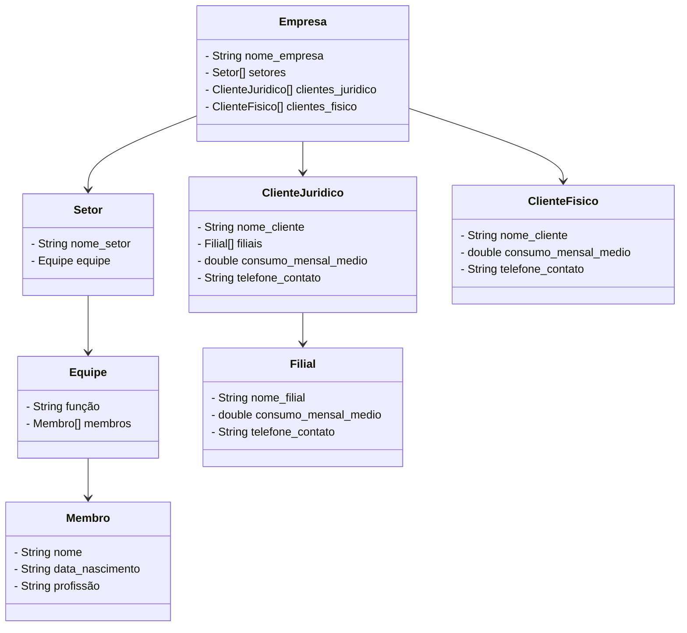

# RESTful API da Santander 
### construída em Java 17 com Spring Boot 3.

```mermaid
classDiagram

class Empresa {
  - String nome_empresa
  - Setor[] setores
  - ClienteJuridico[] clientes_juridico
  - ClienteFisico[] clientes_fisico
}

class Setor {
  - String nome_setor
  - Equipe equipe
}

class Equipe {
  - String função
  - Membro[] membros
}

class Membro {
  - String nome
  - String data_nascimento
  - String profissão
}

class ClienteJuridico {
  - String nome_cliente
  - Filial[] filiais
  - double consumo_mensal_medio
  - String telefone_contato
}

class Filial {
  - String nome_filial
  - double consumo_mensal_medio
  - String telefone_contato
}

class ClienteFisico {
  - String nome_cliente
  - double consumo_mensal_medio
  - String telefone_contato
}

Empresa --> Setor
Empresa --> ClienteJuridico
Empresa --> ClienteFisico
Setor --> Equipe
Equipe --> Membro
ClienteJuridico --> Filial
```